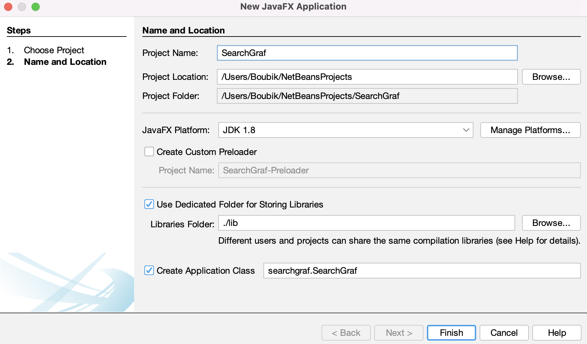
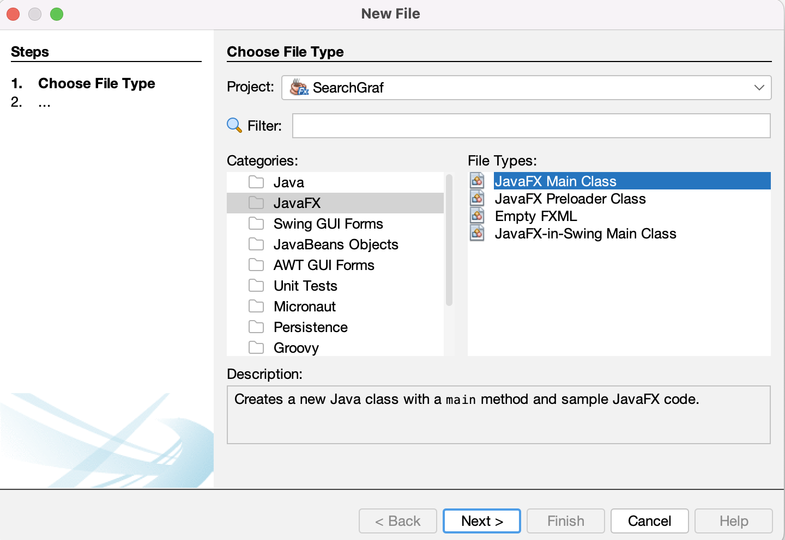
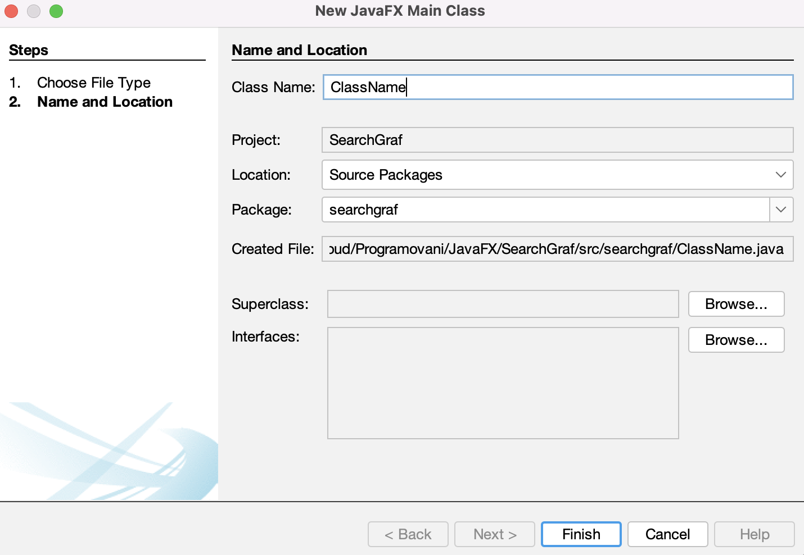

# Search Graf

A program that utilizes Dijkstra's algorithm to find the shortest path in a graph and visualizes it using JavaFX technology is a tool for graph visualization and analysis. The program allows loading the graph structure from an input CSV file, where vertices, edges, and their weights are defined.

During the computation, the algorithm traverses the edges of the graph and assigns temporary distance values to the vertices from the starting vertex. Based on these values, the algorithm selects the nearest unvisited vertex and updates the temporary distance values for adjacent vertices.

After the computation is complete, the program displays the shortest path between the selected vertices in the form of a graphical output in JavaFX. This allows users to visually observe the discovered path and analyze the distances between vertices.

This program combines Dijkstra's algorithm for finding the shortest path in a graph with the use of JavaFX for graph visualization and algorithm results. It is a useful tool for studying and analyzing graphs, enabling users to easily explore and understand their structure and distances between individual vertices.

# Content

1. [Requirements](#requirements)
1. [CSV](#csv)
1. [Creating New Project](#creating-new-project)
1. [Creating Classes](#creating-new-project)
    1. [Node Class](#node-class)
    1. [Connection Class](#connection-class)
    1. [SearchGraf Class](#search-graf)

# Requirements

- JavaFX
- Netbeans

# CSV

The Node-Path structure is a representation of a graph-like data structure consisting of nodes and paths. Each node contains three attributes: X, Y, and Name, while each path contains two attributes: Name and Rank. The structure follows the format:

```
Node[X,Y,Name];Path[Name,Rank];Path[Name,Rank];Path[Name,Rank]
```

Here's an example of the structure with explanations:

```csv
126,71,D;A,1;F,6
516,161,C;B,5;F,5
321,71,F;C,5;D,6;B,2
126,232,A;D,1;B,1
321,232,B;A,1;C,5;F,2
```

In this example, there are five nodes and several paths connecting them. Let's visualize the graph based on the provided information:

```
x_______x
|       |\
|       | x
|       |/
x_______x
```

Here's a breakdown of the provided example:

- Node: X=126, Y=71, Name=D

  - Path: Name=A, Rank=1

  - Path: Name=F, Rank=6

- Node: X=516, Y=161, Name=C

  - Path: Name=B, Rank=5

  - Path: Name=F, Rank=5

- Node: X=321, Y=71, Name=F

  - Path: Name=C, Rank=5

  - Path: Name=D, Rank=6

  - Path: Name=B, Rank=2

- Node: X=126, Y=232, Name=A

  - Path: Name=D, Rank=1

  - Path: Name=B, Rank=1

- Node: X=321, Y=232, Name=B
  - Path: Name=A, Rank=1

  - Path: Name=C, Rank=5

  - Path: Name=F, Rank=2

# Creating New Project

Click on New Project –> Java with Ant -> JavaFX -> JavaFX Application


In this phase of the project, we will proceed with the development of the essential classes required for the search graph application, with the project being renamed to "SearchGraf" and the appropriate location being determined.



# Creating Classes

In this phase of our project, we will proceed with the development of the essential classes required for our graph search application.

Click on New File -> JavaFx -> JavaFX Main Class



Dont forget to change name of the Class to appropriate Class.



## Node Class

The Node class represents a node in a graph. Each node has an x and y coordinate, a name for identification, and a list of connections to other nodes.

### Properties

- x (integer): The x-coordinate of the node.

- y (integer): The y-coordinate of the node.

- name (string): The name of the node.

- connections (list of Connection objects): The list of connections from this node to other nodes.

```java
    private int x;
    private int y;
    private String name;
    private List<Connection> connections = new ArrayList<>();
```

### Methods

- Node(): Default constructor for the Node class.

- Node(x: int, y: int): Constructs a new Node object with the specified x and y coordinates.

- setName(name: string): Sets the name of the node.

- getName(): string: Returns the name of the node.

- setX(x: int): Sets the x-coordinate of the node.

- setY(y: int): Sets the y-coordinate of the node.

- getX(): int: Returns the x-coordinate of the node.

- getY(): int: Returns the y-coordinate of the node.

- addConnection(connection: Connection): Adds a connection to the list of connections for this node.

- getConnection(): List\<Connection\>: Returns the list of connections for this node.

### Final Node Class

```java
package searchgraf;

import java.util.ArrayList;
import java.util.List;

/**
 *
 * @author Boubik
 */
public class Node {
    
    private int x;
    private int y;
    private String name;
    private List<Connection> connections = new ArrayList<>();
    
    public Node(){
    }
    
    public Node(int x, int y){
        setX(x);
        setY(y);
    }
    
    public void setName(String name){
        this.name = name;
    }
    
    public String getName(){
        return name;
    }
    
    public void setX(int x){
        this.x = x;
    }
    
    public void setY(int y){
        this.y = y;
    }
    
    public int getX(){
        return x;
    }
    
    public int getY(){
        return y;
    }
    
    public void addConnection(Connection connection){
        this.connections.add(connection);
    }
    
    public List<Connection> GetConnection(){
        return this.connections;
    }
}

```

### Usage

1. Create a new Node object:

    ```java
    Node node = new Node();
    ```

1. Set the name of the node:

    ```java
    node.setName("Node1");
    ```

1. Set the coordinates of the node:

    ```java
    node.setX(10);
    node.setY(20);
    ```

1. Set the name of the node:

    ```java
    node.setName("Node1");
    ```

## Connection Class

The Connection class represents a connection between two nodes in a graph. Each connection has two nodes (Node objects), denoted as Node a and Node b, and a rank value.

### Properties

- a (Node): The first node in the connection.

- b (Node): The second node in the connection.

- rank (integer): The rank value associated with the connection.

```java
    private Node a;
    private Node b;
    private int rank;
```

### Methods

- Connection(a: Node, b: Node, rank: int): Constructs a new Connection object with the specified nodes and rank.

- setA(a: Node): Sets the first node of the connection.

- setB(b: Node): Sets the second node of the connection.

- setRank(rank: int): Sets the rank value of the connection.

- getA(): Node: Returns the first node of the connection.

- getB(): Node: Returns the second node of the connection.

- getAX(): int: Returns the x-coordinate of the first node.

- getAY(): int: Returns the y-coordinate of the first node.

- getBX(): int: Returns the x-coordinate of the second node.

- getBY(): int: Returns the y-coordinate of the second node.

- getAName(): String: Returns the name of the first node.

### Final Node Class

```java
package searchgraf;

/**
 *
 * @author Boubik
 */
public class Connection {
    
    private Node a;
    private Node b;
    private int rank;
    
    public Connection(Node a, Node b, int rank){
        setA(a);
        setB(b);
        setRank(rank);
    }
    
    public void setA(Node a){
        this.a = a;
    }
    
    public void setB(Node b){
        this.b = b;
    }
    
    public void setRank(int rank){
        this.rank = rank;
    }
    
    public Node getA(){
        return a;
    }
    
    public Node getB(){
        return b;
    }
    
    public int getAX(){
        return a.getX();
    }
    
    public int getAY(){
        return a.getY();
    }
    
    public int getBX(){
        return b.getX();
    }
    
    public int getBY(){
        return b.getY();
    }
    
    public String getAName(){
        return a.getName();
    }
    
    public String getBName(){
        return b.getName();
    }
    
    public int getRank(){
        return rank;
    }
}
```

### Usage

1. Create a new Connection object:

    ```java
    Connection connection = new Connection(node1, node2, 5);
    ```

1. Set the nodes and rank for the connection:

    ```java
    connection.setA(node1);
    connection.setB(node2);
    connection.setRank(5);
    ```

1. Retrieve information about the connection:

    ```java
    Node nodeA = connection.getA();
    Node nodeB = connection.getB();
    int rank = connection.getRank();
    int nodeAX = connection.getAX();
    int nodeAY = connection.getAY();
    int nodeBX = connection.getBX();
    int nodeBY = connection.getBY();
    String nodeAName = connection.getAName();
    String nodeBName = connection.getBName();
    ```

## Graf Class

The Graf class represents a graph that consists of nodes and connections between them. It provides methods to find the shortest path between two nodes in the graph using Dijkstra's algorithm.

### Properties

- start: Represents the starting node of the graph.
- end: Represents the destination node of the graph.
- nodes: A list of nodes in the graph.

```java
    private Node start;
    private Node end;
    private List<Node> nodes;
```

### Methods

- Graf(Node start, Node end, List\<Node\> list): Constructor for the Graf class. It initializes the graph with the specified start and end nodes, along with a list of nodes.

- setList(List\<Node\> list): Sets the list of nodes in the graph.

- setStart(Node start): Sets the starting node of the graph.

- setEnd(Node end): Sets the destination node of the graph.

- getStart(): Node: Retrieves the starting node of the graph.

- getEnd(): Node: Retrieves the destination node of the graph.

- getStartX(): int: Retrieves the x-coordinate of the starting node.

- getStartY(): int: Retrieves the y-coordinate of the starting node.

- getEndX(): int: Retrieves the x-coordinate of the destination node.

- getEndY(): int: Retrieves the y-coordinate of the destination node.

- getShortestPath(Node start, Node end): String: Calculates and returns the shortest path between the specified start and end nodes. It internally calls the getShortestPath() method.
- getShortestPath(): String: Calculates and returns the shortest path between the start and end nodes using Dijkstra's algorithm. It returns the shortest path as a string representation.

- getNode(String value): Node: Retrieves the node object based on the provided coordinates in the format "x,y".

- getNodePositionInTable(List\<String\> table, Node currNode): int: Retrieves the position of the specified node in the given table.

### Final Node Class

```java
package searchgraf;

import java.util.ArrayList;
import java.util.List;

/**
 *
 * @author Boubik
 */
public class Graf {

    private Node start;
    private Node end;
    private List<Node> nodes;

    public Graf(Node start, Node end, List<Node> list) {
        setStart(start);
        setEnd(end);
        setList(list);
    }

    public void setList(List<Node> list) {
        this.nodes = new ArrayList<>(list);
    }

    public void setStart(Node start) {
        this.start = start;
    }

    public void setEnd(Node end) {
        this.end = end;
    }

    public Node getStart() {
        return start;
    }

    public Node getEnd() {
        return end;
    }

    public int getStartX() {
        return start.getX();
    }

    public int getStartY() {
        return start.getY();
    }

    public int getEndX() {
        return end.getX();
    }

    public int getEendY() {
        return end.getY();
    }
    public String getShortestPath(Node start, Node end) {
        setStart(start);
        setEnd(end);
        return getShortestPath();
    }

    public String getShortestPath() {
        //Dijkstra's algorithm
        List<Node> unvisited = new ArrayList<>(nodes);
        List<Node> visited = new ArrayList<>();
        List<String> table = new ArrayList<>();
        Node currentNode = new Node();
        Node subCurrentNode = new Node();
        List<Connection> currentConnections = new ArrayList<>();
        nodes.forEach((item) -> {
            if (start == item) {
                table.add(item.getX() + "," + item.getY() + ";0" + ";");
            } else {
                table.add(item.getX() + "," + item.getY() + ";9999999" + ";");
            }
        });
        System.out.println("\nSide table");
        for (String item : table) {
            System.out.println(item);
        }

        int k = 0;
        while (unvisited.size() != 1) {
            int startRank = 0;
            int lovest = -1;
            int i = 0;
            while (i < table.size()) {
                String[] values = table.get(i).split(";");
                subCurrentNode = getNode(values[0]);
                if ((lovest == -1 || Integer.parseInt(values[1]) < lovest) && unvisited.contains(subCurrentNode)) {
                    lovest = Integer.parseInt(values[1]);
                    currentNode = subCurrentNode;
                    currentConnections = currentNode.GetConnection();
                    startRank = Integer.parseInt(values[1]);
                }
                i++;
            }

            Node a = new Node();
            Node b = new Node();
            for (Connection item : currentConnections) {
                int rank = startRank + item.getRank();
                if (currentNode == item.getA()) {
                    a = item.getA();
                    b = item.getB();
                } else {
                    a = item.getB();
                    b = item.getA();
                }

                i = 0;
                while (i < table.size()) {
                    String[] values = table.get(i).split(";");
                    subCurrentNode = getNode(values[0]);
                    if (b == subCurrentNode && (rank < Integer.parseInt(values[1]) || Integer.parseInt(values[1]) == -1)) {
                        table.set(i, values[0] + ";" + rank + ";" + getNodePositionInTable(table, currentNode));
                        break;
                    }
                    i++;
                }
            }
            visited.add(a);
            unvisited.remove(a);
            k++;
        }
        System.out.println("\nSide table");
        for (String item : table) {
            System.out.println(item);
        }

        String path = end.getName() + "[" + end.getX() + "," + end.getY() + "]";
        String zacatek = "";
        Node curr = end;
        int i = 0;
        while (curr != start) {
            for (String item : table) {
                String[] snode = item.split(";");
                Node susCurr = getNode(snode[0]);
                if (susCurr == end) {
                    zacatek = "Délka: " + snode[1] + "\nCesta: ";
                }
                if (curr == susCurr) {
                    String[] next = table.get(Integer.parseInt(snode[2])).split(";");
                    curr = getNode(next[0]);
                    path = curr.getName() + "["+curr.getX() + "," + curr.getY()+"]" + " -> " + path;
                    break;
                }
            }
            i++;
        }

        return zacatek + path;
    }

    public Node getNode(String value) {
        String[] snode = value.split(",");

        for (Node item : nodes) {
            if (item.getX() == Integer.parseInt(snode[0]) && item.getY() == Integer.parseInt(snode[1])) {
                return item;
            }
        }

        return null;
    }

    public int getNodePositionInTable(List<String> table, Node currNode) {
        for (String item : table) {
            String[] values = item.split(";");
            String[] snode = values[0].split(",");
            if (currNode.getX() == Integer.parseInt(snode[0]) && currNode.getY() == Integer.parseInt(snode[1])) {
                return table.indexOf(item);
            }
        }
        return -1;
    }

}
```

### Usage

Create an instance of the Graf class, providing the start and end nodes, as well as a list of nodes.
Use the appropriate setter methods to set the list of nodes, start node, and end node if needed.
Call the getShortestPath() method to calculate and retrieve the shortest path between the start and end nodes.
Optionally, you can use the getter methods to retrieve the coordinates of the start and end nodes.

```java
Node startNode = new Node(0, 0, "A");
Node endNode = new Node(5, 5, "B");
List<Node> nodeList = new ArrayList<>();
// Add nodes to the nodeList

Graf graph = new Graf(startNode, endNode, nodeList);
String shortestPath = graph.getShortestPath();
System.out.println("Shortest path: " + shortestPath);
```

## SearchGraf Class
