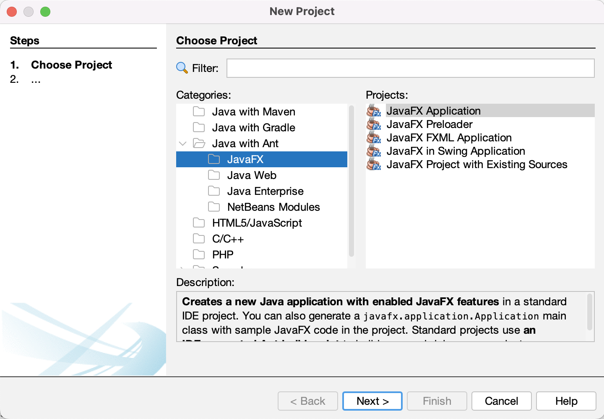

# Search Graf

A program that utilizes Dijkstra's algorithm to find the shortest path in a graph and visualizes it using JavaFX technology is a tool for graph visualization and analysis. The program allows loading the graph structure from an input CSV file, where vertices, edges, and their weights are defined.

During the computation, the algorithm traverses the edges of the graph and assigns temporary distance values to the vertices from the starting vertex. Based on these values, the algorithm selects the nearest unvisited vertex and updates the temporary distance values for adjacent vertices.

After the computation is complete, the program displays the shortest path between the selected vertices in the form of a graphical output in JavaFX. This allows users to visually observe the discovered path and analyze the distances between vertices.

This program combines Dijkstra's algorithm for finding the shortest path in a graph with the use of JavaFX for graph visualization and algorithm results. It is a useful tool for studying and analyzing graphs, enabling users to easily explore and understand their structure and distances between individual vertices.

# Content

1. [Requirements](#requirements)
1. [CSV](#csv)
1. [Creating New Project](#creating-new-project)
1. [Creating Classes](#creating-new-project)
    1. [Node Class](#node-class)
    1. [Connection Class](#connection-class)
    1. [Graf Class](#graf-class)
    1. [SearchGraf Class](#searchgraf-class)

# Requirements

- JavaFX
- Netbeans

# CSV

The Node-Path structure is a representation of a graph-like data structure consisting of nodes and paths. Each line consists of one node and an arbitrary number of paths. Each node contains three attributes: X, Y, and Name, while each path contains two attributes: Name and Rank. The structure follows the format:

```
Node[X,Y,Name];Path[Name,Rank];Path[Name,Rank];Path[Name,Rank]...
```

Here's an example of the structure with explanations:

```csv
126,71,D;A,1;F,6
516,161,C;B,5;F,5
321,71,F;C,5;D,6;B,2
126,232,A;D,1;B,1
321,232,B;A,1;C,5;F,2
```

In this example, there are five nodes and several paths connecting them. Let's visualize the graph based on the provided information:

```
x_______x
|       |\
|       | x
|       |/
x_______x
```

Here's a breakdown of the provided example:

- Node: X=126, Y=71, Name=D

  - Path: Name=A, Rank=1

  - Path: Name=F, Rank=6

- Node: X=516, Y=161, Name=C

  - Path: Name=B, Rank=5

  - Path: Name=F, Rank=5

- Node: X=321, Y=71, Name=F

  - Path: Name=C, Rank=5

  - Path: Name=D, Rank=6

  - Path: Name=B, Rank=2

- Node: X=126, Y=232, Name=A

  - Path: Name=D, Rank=1

  - Path: Name=B, Rank=1

- Node: X=321, Y=232, Name=B
  - Path: Name=A, Rank=1

  - Path: Name=C, Rank=5

  - Path: Name=F, Rank=2

## another examples

example

```
126,71,A;B,9;C,4
321,71,B;A,2;C,3
321,232,C;A,4;B,3
```

graf

```
x_______x
  \     |
    \   |
      \ |
        x
```

example

```
100,200,Home;Park,3;School,6
650,250,Restaurant;Mall,2
200,150,Park;Home,3;Shop,5;School,4
250,250,Shop;Park,5;School,2;Library,3
350,150,School;Home,6;Park,4;Shop,2;Library,5
450,250,Library;Shop,3;School,5;Cinema,4
550,200,Cinema;Library,4;Mall,5
550,300,Mall;Cinema,5;Restaurant,2
```

# Creating New Project

Click on New Project –> Java with Ant -> JavaFX -> JavaFX Application



In this phase of the project, we will proceed with the development of the essential classes required for the search graph application, with the project being renamed to "SearchGraf" and the appropriate location being determined.


# Creating Classes

In this phase of our project, we will proceed with the development of the essential classes required for our graph search application.

Click on New File -> JavaFx -> JavaFX Main Class


Dont forget to change name of the Class to appropriate Class.


## Node Class

The Node class represents a node in a graph. Each node has an x and y coordinate, a name for identification, and a list of connections to other nodes.

### Properties

- x (integer): The x-coordinate of the node.

- y (integer): The y-coordinate of the node.

- name (string): The name of the node.

- connections (list of Connection objects): The list of connections from this node to other nodes.

```java
    private int x;
    private int y;
    private String name;
    private List<Connection> connections = new ArrayList<>();
```

### Methods

- Node(): Default constructor for the Node class.

- Node(x: int, y: int): Constructs a new Node object with the specified x and y coordinates.

- setName(name: string): Sets the name of the node.

- getName(): string: Returns the name of the node.

- setX(x: int): Sets the x-coordinate of the node.

- setY(y: int): Sets the y-coordinate of the node.

- getX(): int: Returns the x-coordinate of the node.

- getY(): int: Returns the y-coordinate of the node.

- addConnection(connection: Connection): Adds a connection to the list of connections for this node.

- getConnection(): List\<Connection\>: Returns the list of connections for this node.

### Final Node Class

```java
package searchgraf;

import java.util.ArrayList;
import java.util.List;

/**
 * Represents a node with connections in a graph.
 * @author Boubik
 */
public class Node {
    
    private int x;
    private int y;
    private String name;
    private List<Connection> connections = new ArrayList<>();
    
    /**
     * Default constructor for Node.
     */
    public Node(){
    }
    
    /**
     * Constructor for Node with coordinates.
     *
     * @param x The x-coordinate of the node.
     * @param y The y-coordinate of the node.
     */
    public Node(int x, int y){
        setX(x);
        setY(y);
    }
    
    /**
     * Sets the name of the node.
     *
     * @param name The name to set for the node.
     */
    public void setName(String name){
        this.name = name;
    }
    
    /**
     * Retrieves the name of the node.
     *
     * @return The name of the node.
     */
    public String getName(){
        return name;
    }
    
    /**
     * Sets the x-coordinate of the node.
     *
     * @param x The x-coordinate to set for the node.
     */
    public void setX(int x){
        this.x = x;
    }
    
    /**
     * Sets the y-coordinate of the node.
     *
     * @param y The y-coordinate to set for the node.
     */
    public void setY(int y){
        this.y = y;
    }
    
    /**
     * Retrieves the x-coordinate of the node.
     *
     * @return The x-coordinate of the node.
     */
    public int getX(){
        return x;
    }
    
    /**
     * Retrieves the y-coordinate of the node.
     *
     * @return The y-coordinate of the node.
     */
    public int getY(){
        return y;
    }
    
    /**
     * Adds a connection to the list of connections for this node.
     *
     * @param connection The connection to add.
     */
    public void addConnection(Connection connection){
        this.connections.add(connection);
    }
    
    /**
     * Retrieves the list of connections associated with this node.
     *
     * @return The list of connections.
     */
    public List<Connection> GetConnection(){
        return this.connections;
    }
}
```

### Usage

1. Create a new Node object:

    ```java
    Node node = new Node();
    ```

1. Set the name of the node:

    ```java
    node.setName("Node1");
    ```

1. Set the coordinates of the node:

    ```java
    node.setX(10);
    node.setY(20);
    ```

1. Set the name of the node:

    ```java
    node.setName("Node1");
    ```

## Connection Class

The Connection class represents a connection between two nodes in a graph. Each connection has two nodes (Node objects), denoted as Node a and Node b, and a rank value.

### Properties

- a (Node): The first node in the connection.

- b (Node): The second node in the connection.

- rank (integer): The rank value associated with the connection.

```java
    private Node a;
    private Node b;
    private int rank;
```

### Methods

- Connection(a: Node, b: Node, rank: int): Constructs a new Connection object with the specified nodes and rank.

- setA(a: Node): Sets the first node of the connection.

- setB(b: Node): Sets the second node of the connection.

- setRank(rank: int): Sets the rank value of the connection.

- getA(): Node: Returns the first node of the connection.

- getB(): Node: Returns the second node of the connection.

- getAX(): int: Returns the x-coordinate of the first node.

- getAY(): int: Returns the y-coordinate of the first node.

- getBX(): int: Returns the x-coordinate of the second node.

- getBY(): int: Returns the y-coordinate of the second node.

- getAName(): String: Returns the name of the first node.

### Final Connection Class

```java
package searchgraf;

/**
 * Represents a connection between two nodes in a graph.
 * @author Boubik
 */
public class Connection {
    
    // Private instance variables to store the nodes and rank of the connection.
    private Node a;
    private Node b;
    private int rank;
    
    /**
     * Constructs a Connection object with the specified nodes and rank.
     * 
     * @param a The first node in the connection.
     * @param b The second node in the connection.
     * @param rank The rank associated with the connection.
     */
    public Connection(Node a, Node b, int rank){
        setA(a);
        setB(b);
        setRank(rank);
    }
    
    /**
     * Sets the first node of the connection.
     * 
     * @param a The first node to set.
     */
    public void setA(Node a){
        this.a = a;
    }
    
    /**
     * Sets the second node of the connection.
     * 
     * @param b The second node to set.
     */
    public void setB(Node b){
        this.b = b;
    }
    
    /**
     * Sets the rank of the connection.
     * 
     * @param rank The rank to set for the connection.
     */
    public void setRank(int rank){
        this.rank = rank;
    }
    
    /**
     * Retrieves the first node of the connection.
     * 
     * @return The first node of the connection.
     */
    public Node getA(){
        return a;
    }
    
    /**
     * Retrieves the second node of the connection.
     * 
     * @return The second node of the connection.
     */
    public Node getB(){
        return b;
    }
    
    /**
     * Retrieves the x-coordinate of the first node.
     * 
     * @return The x-coordinate of the first node.
     */
    public int getAX(){
        return a.getX();
    }
    
    /**
     * Retrieves the y-coordinate of the first node.
     * 
     * @return The y-coordinate of the first node.
     */
    public int getAY(){
        return a.getY();
    }
    
    /**
     * Retrieves the x-coordinate of the second node.
     * 
     * @return The x-coordinate of the second node.
     */
    public int getBX(){
        return b.getX();
    }
    
    /**
     * Retrieves the y-coordinate of the second node.
     * 
     * @return The y-coordinate of the second node.
     */
    public int getBY(){
        return b.getY();
    }
    
    /**
     * Retrieves the name of the first node.
     * 
     * @return The name of the first node.
     */
    public String getAName(){
        return a.getName();
    }
    
    /**
     * Retrieves the name of the second node.
     * 
     * @return The name of the second node.
     */
    public String getBName(){
        return b.getName();
    }
    
    /**
     * Retrieves the rank of the connection.
     * 
     * @return The rank of the connection.
     */
    public int getRank(){
        return rank;
    }
}
```

### Usage

1. Create a new Connection object:

    ```java
    Connection connection = new Connection(node1, node2, 5);
    ```

1. Set the nodes and rank for the connection:

    ```java
    connection.setA(node1);
    connection.setB(node2);
    connection.setRank(5);
    ```

1. Retrieve information about the connection:

    ```java
    Node nodeA = connection.getA();
    Node nodeB = connection.getB();
    int rank = connection.getRank();
    int nodeAX = connection.getAX();
    int nodeAY = connection.getAY();
    int nodeBX = connection.getBX();
    int nodeBY = connection.getBY();
    String nodeAName = connection.getAName();
    String nodeBName = connection.getBName();
    ```

## Graf Class

The Graf class represents a graph that consists of nodes and connections between them. It provides methods to find the shortest path between two nodes in the graph using Dijkstra's algorithm.

### Properties

- start: Represents the starting node of the graph.
- end: Represents the destination node of the graph.
- nodes: A list of nodes in the graph.

```java
    private Node start;
    private Node end;
    private List<Node> nodes;
```

### Methods

- Graf(Node start, Node end, List\<Node\> list): Constructor for the Graf class. It initializes the graph with the specified start and end nodes, along with a list of nodes.

- setList(List\<Node\> list): Sets the list of nodes in the graph.

- setStart(Node start): Sets the starting node of the graph.

- setEnd(Node end): Sets the destination node of the graph.

- getStart(): Node: Retrieves the starting node of the graph.

- getEnd(): Node: Retrieves the destination node of the graph.

- getStartX(): int: Retrieves the x-coordinate of the starting node.

- getStartY(): int: Retrieves the y-coordinate of the starting node.

- getEndX(): int: Retrieves the x-coordinate of the destination node.

- getEndY(): int: Retrieves the y-coordinate of the destination node.

- getShortestPath(Node start, Node end): String: Calculates and returns the shortest path between the specified start and end nodes. It internally calls the getShortestPath() method.
- getShortestPath(): String: Calculates and returns the shortest path between the start and end nodes using Dijkstra's algorithm. It returns the shortest path as a string representation.

- getNode(String value): Node: Retrieves the node object based on the provided coordinates in the format "x,y".

- getNodePositionInTable(List\<String\> table, Node currNode): int: Retrieves the position of the specified node in the given table.

### Final Graf Class

```java
package searchgraf;

import java.util.ArrayList;
import java.util.List;

/**
 * The Graf class represents a graph with nodes and connections.
 *
 * @author Boubik
 */
public class Graf {

    // Class variables
    private Node start;
    private Node end;
    private List<Node> nodes;

    /**
     * Constructs a Graf instance with a start node, an end node, and a list of
     * nodes.
     *
     * @param start The starting node.
     * @param end The ending node.
     * @param list The list of nodes in the graph.
     */
    public Graf(Node start, Node end, List<Node> list) {
        setStart(start);
        setEnd(end);
        setList(list);
    }

    /**
     * Sets the list of nodes for the graph.
     *
     * @param list The list of nodes to set.
     */
    public void setList(List<Node> list) {
        this.nodes = new ArrayList<>(list);
    }

    /**
     * Sets the start node of the graph.
     *
     * @param start The start node to set.
     */
    public void setStart(Node start) {
        this.start = start;
    }

    /**
     * Sets the end node of the graph.
     *
     * @param end The end node to set.
     */
    public void setEnd(Node end) {
        this.end = end;
    }

    /**
     * Retrieves the start node of the graph.
     *
     * @return The start node.
     */
    public Node getStart() {
        return start;
    }

    /**
     * Retrieves the end node of the graph.
     *
     * @return The end node.
     */
    public Node getEnd() {
        return end;
    }

    /**
     * Retrieves the x-coordinate of the start node.
     *
     * @return The x-coordinate of the start node.
     */
    public int getStartX() {
        return start.getX();
    }

    /**
     * Retrieves the y-coordinate of the start node.
     *
     * @return The y-coordinate of the start node.
     */
    public int getStartY() {
        return start.getY();
    }

    /**
     * Retrieves the x-coordinate of the end node.
     *
     * @return The x-coordinate of the end node.
     */
    public int getEndX() {
        return end.getX();
    }

    /**
     * Retrieves the y-coordinate of the end node.
     *
     * @return The y-coordinate of the end node.
     */
    public int getEndY() {
        return end.getY();
    }
    
    /**
     * This will print out side table of Dijkstra's algorithm
     * @param table of strigns from side table
     */
    public void printSideTable(List<String> table){
        System.out.println("\nSide table");
        for (String item : table) {
            System.out.println(item);
        }
    }

    /**
     * Calculates and returns the shortest path using Dijkstra's algorithm.
     *
     * @return A string representation of the shortest path.
     */
    public String getShortestPath() {
        // Initialization
        List<Node> unvisited = new ArrayList<>(nodes);
        List<Node> visited = new ArrayList<>();
        List<String> table = new ArrayList<>();
        Node currentNode = new Node();
        Node subCurrentNode = new Node();
        List<Connection> currentConnections = new ArrayList<>();

        // Initializing table values
        nodes.forEach((item) -> {
            if (start == item) {
                table.add(item.getX() + "," + item.getY() + ";0" + ";");
            } else {
                table.add(item.getX() + "," + item.getY() + ";9999999" + ";");
            }
        });
        
        // Print side table init
        printSideTable(table);

        // Dijkstra's algorithm
        int k = 0;
        while (unvisited.size() != 1) {
            int startRank = 0;
            int lovest = -1;
            int i = 0;
            while (i < table.size()) {
                String[] values = table.get(i).split(";");
                subCurrentNode = getNode(values[0]);
                if ((lovest == -1 || Integer.parseInt(values[1]) < lovest) && unvisited.contains(subCurrentNode)) {
                    lovest = Integer.parseInt(values[1]);
                    currentNode = subCurrentNode;
                    currentConnections = currentNode.GetConnection();
                    startRank = Integer.parseInt(values[1]);
                }
                i++;
            }

            Node a = new Node();
            Node b = new Node();
            for (Connection item : currentConnections) {
                int rank = startRank + item.getRank();
                if (currentNode == item.getA()) {
                    a = item.getA();
                    b = item.getB();
                } else {
                    a = item.getB();
                    b = item.getA();
                }

                i = 0;
                while (i < table.size()) {
                    String[] values = table.get(i).split(";");
                    subCurrentNode = getNode(values[0]);
                    if (b == subCurrentNode && (rank < Integer.parseInt(values[1]) || Integer.parseInt(values[1]) == -1)) {
                        table.set(i, values[0] + ";" + rank + ";" + getNodePositionInTable(table, currentNode));
                        break;
                    }
                    i++;
                }
            }
            visited.add(a);
            unvisited.remove(a);
            k++;
        }

        // Showing table values
        printSideTable(table);

        // Constructing the shortest path
        String path = end.getName() + "[" + end.getX() + "," + end.getY() + "]";
        String zacatek = "";
        Node curr = end;
        int i = 0;
        while (curr != start) {
            for (String item : table) {
                String[] snode = item.split(";");
                Node susCurr = getNode(snode[0]);
                if (susCurr == end) {
                    zacatek = "Délka: " + snode[1] + "\nCesta: ";
                }
                if (curr == susCurr) {
                    String[] next = table.get(Integer.parseInt(snode[2])).split(";");
                    curr = getNode(next[0]);
                    path = curr.getName() + "[" + curr.getX() + "," + curr.getY() + "]" + " -> " + path;
                    break;
                }
            }
            i++;
        }

        return zacatek + path;
    }

    /**
     * Retrieves a Node based on its coordinates.
     *
     * @param value The coordinates of the Node in the format "x,y".
     * @return The Node with the specified coordinates, or null if not found.
     */
    public Node getNode(String value) {
        String[] snode = value.split(",");

        for (Node item : nodes) {
            if (item.getX() == Integer.parseInt(snode[0]) && item.getY() == Integer.parseInt(snode[1])) {
                return item;
            }
        }

        return null;
    }

    /**
     * Retrieves the position of a Node in the table.
     *
     * @param table The list of strings representing the table.
     * @param currNode The Node whose position is being sought.
     * @return The index of the Node in the table, or -1 if not found.
     */
    public int getNodePositionInTable(List<String> table, Node currNode) {
        for (String item : table) {
            String[] values = item.split(";");
            String[] snode = values[0].split(",");
            if (currNode.getX() == Integer.parseInt(snode[0]) && currNode.getY() == Integer.parseInt(snode[1])) {
                return table.indexOf(item);
            }
        }
        return -1;
    }

}
```

### Usage

Create an instance of the Graf class, providing the start and end nodes, as well as a list of nodes.
Use the appropriate setter methods to set the list of nodes, start node, and end node if needed.
Call the getShortestPath() method to calculate and retrieve the shortest path between the start and end nodes.
Optionally, you can use the getter methods to retrieve the coordinates of the start and end nodes.

```java
Node startNode = new Node(0, 0, "A");
Node endNode = new Node(5, 5, "B");
List<Node> nodeList = new ArrayList<>();
// Add nodes to the nodeList

Graf graph = new Graf(startNode, endNode, nodeList);
String shortestPath = graph.getShortestPath();
System.out.println("Shortest path: " + shortestPath);
```

## SearchGraf Class

The SearchGraf class is the main class of the application that represents a graphical search algorithm. It extends the JavaFX Application class to create and display the graphical user interface. The class is responsible for reading input data, creating nodes and connections, and displaying them on the screen. It also calculates the shortest path between two nodes using the Graf class and highlights it on the screen. The class uses JavaFX for the graphical user interface, including shapes, lines, and text elements.

Create an instance of the SearchGraf class.
Call the start() method to start the application and display the graphical user interface.

### Final Graf Class

```java
package searchgraf;

import java.io.BufferedReader;
import java.io.File;
import java.io.FileReader;
import java.io.IOException;
import java.util.ArrayList;
import java.util.Arrays;
import java.util.Collections;
import java.util.List;
import java.util.Random;
import java.util.function.Consumer;
import java.util.regex.Matcher;
import java.util.regex.Pattern;
import javafx.application.Application;
import static javafx.application.Application.launch;
import javafx.scene.Group;
import javafx.scene.Scene;
import javafx.scene.paint.Color;
import javafx.scene.shape.Circle;
import javafx.scene.shape.Line;
import javafx.stage.Stage;
import javafx.scene.shape.Path;
import javafx.scene.text.Text;

/**
 *
 * @author Boubik
 */
public class SearchGraf extends Application {

    private static final double arrowLength = 10;
    private static final double arrowWidth = 3;
    private Node start = null; // will be first line
    private Node end = null; // will be second line
    private List<String> lines = new ArrayList<>();
    private List<Node> nodes = new ArrayList<>();
    private List<Connection> connections = new ArrayList<>();
    private final String filepath = "grafs/Graf.Boubik";
    int point = 4; // Size of points

    @Override
    public void start(Stage stage) {

        // Read a file and set start and end Node
        try {
            File file = new File(filepath);           // Create a file instance
            FileReader fr = new FileReader(file);     // Initialize a FileReader to read the file
            BufferedReader br = new BufferedReader(fr); // Create a buffered character input stream
            StringBuffer sb = new StringBuffer();      // Initialize a string buffer

            String line;
            String[] curXY;
            Node a;

            // Read lines from the file and process each line
            while ((line = br.readLine()) != null) {
                lines.add(line);                        // Store the line
                String[] values = line.split(";");       // Split line into values
                curXY = values[0].split(",");            // Split XY coordinates and name

                // Create a new Node with coordinates and name
                a = new Node(Integer.parseInt(curXY[0]), Integer.parseInt(curXY[1]));
                a.setName(curXY[2]);
                nodes.add(a);                            // Add the Node to the list

                // Assign start and end Nodes based on conditions
                if (start == null) {
                    start = a;
                } else {
                    if (end == null) {
                        end = a;
                    }
                }

                sb.append(line);                          // Append line to string buffer
                sb.append("\n");                          // Add a line feed   
            }
            fr.close();    // Close the stream and release resources
            System.out.println("Contents of File: ");
            System.out.println(sb.toString());   // Display the file contents  
        } catch (IOException e) {
            e.printStackTrace();                // Print exception details
        }

        // Process data from the file and categorize it into lists
        int i = 0;
        while (i < lines.size()) {
            String line = lines.get(i);
            String[] values = line.split(";");
            String[] xyname = values[0].split(",");
            Node a = getNodeByName(xyname[2]);
            Node b;
            Connection c;
            int rank;

            int k = 1;
            while (k < values.length) {
                String[] namerank = values[k].split(",");
                b = getNodeByName(namerank[0]);
                rank = Integer.parseInt(namerank[1]);
                c = new Connection(a, b, rank);            // Create a Connection between Nodes
                a.addConnection(c);                        // Add the Connection to Node's connections
                k++;
            }
            i++;
        }

        // Display information about all nodes
        System.out.println("Nodes");
        nodes.forEach((item) -> {
            System.out.println("X: " + item.getX() + " Y: " + item.getY());

        });

        // Initialize necessary objects for graph visualization
        Path path = new Path();
        Group root = new Group(path);
        Graf graf = new Graf(start, end, nodes);          // Create a graph with start, end, and nodes
        String str_path = graf.getShortestPath();          // Get the shortest path as a string
        List<String> conns = new ArrayList<>();

        // Extract connection information using regular expression
        String regex = " [a-zA-Z]+\\[";
        Pattern pattern = Pattern.compile(regex);
        Matcher matcher = pattern.matcher(str_path);
        while (matcher.find()) {
            conns.add(matcher.group().substring(1, matcher.group().length() - 1));
        }
        // Reverse the list of connections for proper order
        Collections.reverse(conns);

        nodes.forEach((Node item) -> {
            // Creating a circle representing the node at the given coordinates
            Circle circle = new Circle(item.getX(), item.getY(), point);

            // Creating a text label for the node
            Text a = new Text();
            a.setText(item.getName());
            a.setX(item.getX() + 3);
            a.setY(item.getY() - 3);

            // Setting color for nodes that are the start or end nodes
            if (start == item || end == item) {
                circle.setFill(javafx.scene.paint.Color.RED);
                a.setFill(javafx.scene.paint.Color.RED);
            }

            // Adding the circle and text label to the root container
            root.getChildren().add(circle);
            root.getChildren().add(a);

            // Getting connections of the current node
            connections = item.GetConnection();
            List<Connection> visitedCon = new ArrayList<>();

            // Iterating through connections of the current node
            connections.forEach((Connection itemc) -> {
                if (visitedCon.contains(itemc)) {
                    return; //continue but java
                }

                // Calculating half of midpoint coordinates for connection text label
                double d = Math.sqrt((itemc.getAX() - itemc.getBX()) * (itemc.getAX() - itemc.getBX()) + (itemc.getAY() - itemc.getBY()) * (itemc.getAY() - itemc.getBY())) / 4;
                Double D = Math.sqrt((itemc.getBX() - itemc.getAX()) * (itemc.getBX() - itemc.getAX()) + (itemc.getBY() - itemc.getAY()) * (itemc.getBY() - itemc.getAY()));
                int x3 = (int) ((itemc.getAX() + (d / D) * (itemc.getBX() - itemc.getAX())));
                int y3 = (int) ((itemc.getAY() + (d / D) * (itemc.getBY() - itemc.getAY())) - 5);

                // Creating and positioning the connection text label
                Text text = new Text();
                text.setText(itemc.getRank() + "");
                text.setX(x3);
                text.setY(y3);
                root.getChildren().add(text);

                // Creating lines to represent connections between nodes
                x3 = (int) ((itemc.getAX() + ((d * 2) / D) * (itemc.getBX() - itemc.getAX())));
                y3 = (int) ((itemc.getAY() + ((d * 2) / D) * (itemc.getBY() - itemc.getAY())));
                Line line = new Line(itemc.getAX(), itemc.getAY(), x3, y3);

                // Creating arrows to represent connections
                Line arrow1 = new Line();
                Line arrow2 = new Line();
                double ex = itemc.getAX();
                double ey = itemc.getAY();
                double sx = itemc.getBX();
                double sy = itemc.getBY();
                arrow1.setEndX(ex);
                arrow1.setEndY(ey);
                arrow2.setEndX(ex);
                arrow2.setEndY(ey);

                // Configuring arrowhead positions for connections
                // (calculations depend on arrowLength and arrowWidth variables)
                if (ex == sx && ey == sy) {
                    // arrow parts of length 0
                    arrow1.setStartX(ex);
                    arrow1.setStartY(ey);
                    arrow2.setStartX(ex);
                    arrow2.setStartY(ey);
                } else {
                    double factor = arrowLength / Math.hypot(sx - ex, sy - ey);
                    double factorO = arrowWidth / Math.hypot(sx - ex, sy - ey);

                    // part in direction of main line
                    double dx = (sx - ex) * factor;
                    double dy = (sy - ey) * factor;

                    // part ortogonal to main line
                    double ox = (sx - ex) * factorO;
                    double oy = (sy - ey) * factorO;
                    arrow1.setStartX(ex + dx - oy);
                    arrow1.setStartY(ey + dy + ox);
                    arrow2.setStartX(ex + dx + oy);
                    arrow2.setStartY(ey + dy - ox);
                }

                // Adjusting color for specific connections based on conditions
                if (conns.contains(itemc.getAName()) && conns.contains(itemc.getBName())) {
                    try {
                        int i1 = conns.indexOf(itemc.getBName());
                        String now = itemc.getAName();
                        String next = itemc.getBName();
                        String now2 = conns.get(--i1);
                        String next2 = conns.get(i1);

                        // color them only if there are in corect way
                        if (next2.equals(next) || now2.equals(now)) {
                            arrow1.setStroke(Color.RED);
                            arrow2.setStroke(Color.RED);
                            line.setStroke(Color.RED);
                        }
                    } catch (IndexOutOfBoundsException e) {
                    }
                }

                // Adding lines and arrowheads to the root container
                visitedCon.add(itemc);
                root.getChildren().add(line);
                root.getChildren().add(arrow1);
                root.getChildren().add(arrow2);
            });
        });

        // Creating a scene object
        Scene scene = new Scene(root, 600, 300);

        // Setting title to the Stage
        stage.setTitle("Graf");

        // Adding scene to the stage
        stage.setScene(scene);

        // Displaying the contents of the stage
        stage.show();

        System.out.println("\n\n" + str_path);
    }

    /**
     * The entry point of the JavaFX application.
     *
     * @param args Command-line arguments passed to the application.
     */
    public static void main(String args[]) {
        launch(args);  // Launches the JavaFX application
    }

    /**
     * Retrieves a Node object based on its name.
     *
     * @param name The name of the Node to be retrieved.
     * @return The Node object with the specified name, or null if not found.
     */
    public Node getNodeByName(String name) {
        int i = 0;
        while (i < nodes.size()) {
            Node node = nodes.get(i);
            if (node.getName().equals(name)) {
                return nodes.get(i);  // Returns the Node object with the matching name
            }
            i++;
        }

        return null;  // Returns null if no Node with the specified name is found
    }
}
```

### Usage of application

#### Screenshot of running application


Observe the application's interface, which illustrates a graph traversal from the starting node D to the destination node C. This journey incurs a total cost of 7 units, and the path taken is visually indicated by a distinctive red highlight. The traversal sequence follows the route D -> A -> B -> C, demonstrating the optimal pathfinding capability of the system

#### log from console

 ``` log
Contents of File: 
126,71,D;A,1;F,6
516,161,C;B,5;F,5
321,71,F;C,5;D,6;B,2
126,232,A;D,1;B,1
321,232,B;A,1;C,5;F,2

Nodes
X: 126 Y: 71
X: 516 Y: 161
X: 321 Y: 71
X: 126 Y: 232
X: 321 Y: 232

Side table
126,71;0;
516,161;9999999;
321,71;9999999;
126,232;9999999;
321,232;9999999;

Side table
126,71;0;
516,161;7;4
321,71;4;4
126,232;1;0
321,232;2;3


Délka: 7
Cesta: D[126,71] -> A[126,232] -> B[321,232] -> C[516,161]
 ```

### another example

#### Screenshot of running application


#### log from console

 ``` log
Contents of File: 
100,200,Home;Park,3;School,6
650,250,Restaurant;Mall,2
200,150,Park;Home,3;Shop,5;School,4
250,250,Shop;Park,5;School,2;Library,3
350,150,School;Home,6;Park,4;Shop,2;Library,5
450,250,Library;Shop,3;School,5;Cinema,4
550,200,Cinema;Library,4;Mall,5
550,300,Mall;Cinema,5;Restaurant,2

Nodes
X: 100 Y: 200
X: 650 Y: 250
X: 200 Y: 150
X: 250 Y: 250
X: 350 Y: 150
X: 450 Y: 250
X: 550 Y: 200
X: 550 Y: 300

Side table
100,200;0;
650,250;9999999;
200,150;9999999;
250,250;9999999;
350,150;9999999;
450,250;9999999;
550,200;9999999;
550,300;9999999;

Side table
100,200;0;
650,250;22;7
200,150;3;0
250,250;8;2
350,150;6;0
450,250;11;4
550,200;15;5
550,300;20;6


Délka: 22
Cesta: Home[100,200] -> School[350,150] -> Library[450,250] -> Cinema[550,200] -> Mall[550,300] -> Restaurant[650,250]
```
